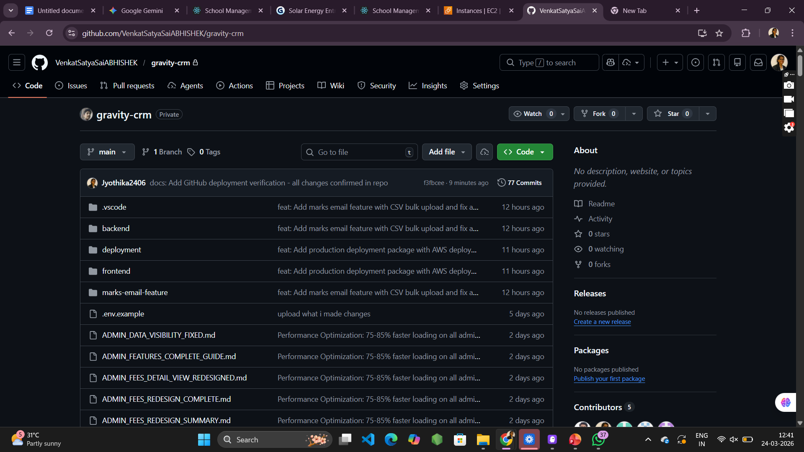

# 📧 Marks Email Notification Feature

## Overview

This feature allows admins to send student exam marks via email automatically. When marks are entered, the system sends a beautifully formatted email to the student's registered email address.

---

## 🚀 Setup

### 1. Configure Email in `.env`

Add these to your `backend/.env` file:

```env
EMAIL_USER=your-email@gmail.com
EMAIL_PASSWORD=your-16-char-app-password
```

### 2. Get Gmail App Password

1. Go to https://myaccount.google.com/security
2. Enable "2-Step Verification"
3. Go to https://myaccount.google.com/apppasswords
4. Select "Mail" and generate password
5. Copy the 16-character password to `EMAIL_PASSWORD` in .env

---

## 📡 API Endpoint

### Send Marks Email

```http
POST /api/admin/marks/send-email
Authorization: Bearer <admin-token>
Content-Type: application/json
```

### Request Body

```json
{
  "studentId": "uuid-of-student",
  "subjectId": "uuid-of-subject",
  "examId": "uuid-of-exam",  // Optional
  "marks": 85,
  "totalMarks": 100,
  "remarks": "Good performance"  // Optional
}
```

### Response (Success)

```json
{
  "success": true,
  "message": "Marks saved and email sent successfully",
  "data": {
    "student": {
      "id": "student-uuid",
      "name": "John Doe",
      "email": "john@example.com"
    },
    "marks": {
      "subject": "Mathematics",
      "marks": 85,
      "totalMarks": 100,
      "percentage": "85.00",
      "grade": "A"
    },
    "examResult": {
      "id": "result-uuid",
      "marksObtained": 85,
      "percentage": 85,
      "grade": "A"
    }
  }
}
```

### Response (Error)

```json
{
  "success": false,
  "message": "Student not found"
}
```

---

## 🎨 Email Template Features

The email sent to students includes:

- **College branding** with college name
- **Student details** (name, class)
- **Subject name**
- **Marks obtained** and total marks
- **Percentage** calculation
- **Grade** (A+, A, B+, B, C, D, F)
- **Motivational message** based on performance
- **Professional design** with gradient colors

---

## 📊 Grade Calculation

| Percentage | Grade |
|------------|-------|
| 90% - 100% | A+    |
| 80% - 89%  | A     |
| 70% - 79%  | B+    |
| 60% - 69%  | B     |
| 50% - 59%  | C     |
| 40% - 49%  | D     |
| Below 40%  | F     |

---

## 🧪 Testing

### Using Postman/Thunder Client

1. **Login as Admin** to get auth token
2. **Create/Get Student** with valid email
3. **Create/Get Subject**
4. **Send marks email:**

```bash
POST http://localhost:5000/api/admin/marks/send-email
Headers:
  Authorization: Bearer YOUR_ADMIN_TOKEN
  Content-Type: application/json

Body:
{
  "studentId": "your-student-uuid",
  "subjectId": "your-subject-uuid",
  "marks": 85,
  "totalMarks": 100
}
```

5. **Check student's email inbox** for the notification

### Using cURL

```bash
curl -X POST http://localhost:5000/api/admin/marks/send-email \
  -H "Authorization: Bearer YOUR_ADMIN_TOKEN" \
  -H "Content-Type: application/json" \
  -d '{
    "studentId": "student-uuid",
    "subjectId": "subject-uuid",
    "marks": 85,
    "totalMarks": 100
  }'
```

---

## ✅ Requirements

- Student must have a valid email address
- Subject must exist in the database
- Marks must be between 0 and totalMarks
- Gmail SMTP must be configured in .env
- Admin must be authenticated

---

## 🔒 Security

- Only admins can send marks emails
- Requires valid authentication token
- College-specific authorization
- Email credentials stored in environment variables
- Uses Gmail App Password (not regular password)

---

## 🐛 Troubleshooting

### Email not sending?

1. **Check .env configuration:**
   ```bash
   # Make sure these are set
   EMAIL_USER=your-email@gmail.com
   EMAIL_PASSWORD=your-app-password
   ```

2. **Verify Gmail App Password:**
   - Must be 16 characters
   - No spaces
   - Generated from Google Account settings

3. **Check student email:**
   ```sql
   SELECT email FROM "Student" WHERE id = 'student-uuid';
   ```

4. **Check spam folder** - emails might be filtered

### "Email configuration not found" error?

Make sure `EMAIL_USER` and `EMAIL_PASSWORD` are set in `backend/.env`

### "Student not found" error?

Verify the studentId exists and belongs to your college:
```sql
SELECT * FROM "Student" WHERE id = 'student-uuid' AND "collegeId" = 'your-college-uuid';
```

---

## 📝 Example Workflow

1. Admin logs into the system
2. Admin navigates to marks entry section
3. Admin selects student and subject
4. Admin enters marks
5. Admin clicks "Send Email"
6. System saves marks to database
7. System calculates percentage and grade
8. System sends formatted email to student
9. Student receives email notification
10. Student views their results

---

## 🎯 Future Enhancements

Possible additions:
- [ ] Send to parent email (CC)
- [ ] PDF attachment of marks
- [ ] SMS notification
- [ ] Bulk email sending
- [ ] Email templates customization
- [ ] Scheduled email sending
- [ ] Email delivery tracking
- [ ] Resend email option

---

## 📞 Support

If you encounter issues:
1. Check the troubleshooting section
2. Verify all environment variables
3. Check backend logs for errors
4. Ensure Gmail App Password is correct

---

**Feature added successfully! 🎉**
